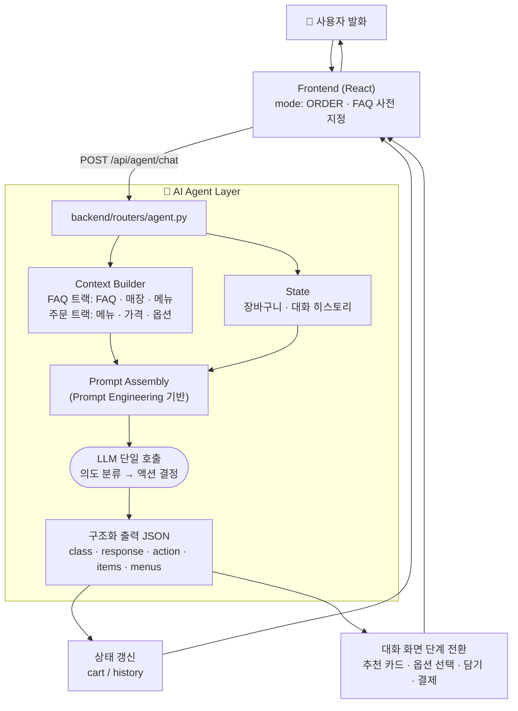

# 골라봄 (GolraBom)

> 말이 서툴러도, 눈치 보지 않아도 괜찮은 키오스크
>
> 2026 AI・SW중심대학 디지털 경진대회 SW 부문 | 팀 아날로그 (한신대학교)

_팀 슬로건 추가 예정_

---

## 문제의식

고령층에게 키오스크는 여전히 높은 벽입니다.

- 2025년 디지털정보격차 실태조사에 따르면, 키오스크로 대표되는 심화 디지털 기술의 고령층 이용률은 **65.3%**로 일반 국민 대비 약 20%p 낮습니다.
- 2022년 한국소비자원 조사에서는 60대 이상 응답자의 **71.2%**가 "뒷사람 눈치가 보여서" 키오스크 이용을 중도 포기했다고 답했습니다.

기존 키오스크는 정보를 일방적으로 제공하는 단방향 구조라, 사용자가 막히는 순간 결국 외부 도움에 의존하게 됩니다. **골라봄**은 이 문제를, UI를 더 단순화하는 방식이 아니라 **양방향 대화**로 접근합니다.

## 데모

[](https://youtu.be/K-bnPAGlwKk)

▶️ **[데모 영상 보기 (YouTube)](https://youtu.be/K-bnPAGlwKk)**

## 핵심 기능

- 🗣️ **대화형 주문** — 음성(STT) 또는 화면 키보드로 주문. 모호한 표현("달달한 거 줘")도 후보 메뉴 추천으로 처리
- 🧭 **발화에 따른 화면 전환** — 추천 카드 → 옵션 선택 → 장바구니 담기 → 결제까지, 다음에 필요한 UI가 대화 화면 안에서 자동으로 이어짐
- 🙋 **고령층 접근성** — 큰 글씨·고대비 전환, 화면 낮추기, 음량 조절, 1분간 응답이 없으면 도움이 필요한지 먼저 물어봄
- 🎤 **메뉴명 인식 보정** — 등록된 메뉴명과 주문 표현을 CLOVA Speech 키워드 부스팅에 넣어 STT 오인식을 줄임
- 🛠️ **매장 어드민** — 메뉴·품절·FAQ·매장정보·주문내역 관리. 변경 내용은 키오스크 화면과 AI 답변에 그대로 반영

## AI Agent 동작 구조



사용자는 시작 화면에서 **"음성으로 주문하기"** 또는 **"궁금한 점 물어보기"** 를 고르고, 이 선택이 요청의 `mode`가 되어 두 개의 트랙으로 갈립니다. 음성 입력은 CLOVA STT로 텍스트 변환된 뒤 해당 트랙으로 들어갑니다.

**FAQ 트랙** (`mode: "faq"`)
등록된 FAQ + 매장정보 + 메뉴 정보(알레르기 유발 성분 포함)를 컨텍스트로 붙여 LLM에 전달하고, `{"response": "..."}` 형태의 답변을 받습니다. 등록된 FAQ 키워드에 걸리지 않는 질문은 LLM이 답을 지어내지 못하도록 "카운터에 문의해 주세요"로 대체합니다.

**주문 트랙** (`mode: "order"`)
메뉴·가격·옵션·품절 정보와 현재 장바구니, 직전 대화 6턴을 함께 전달합니다. LLM은 발화를 `ORDER`(주문·옵션) / `RECOMMEND`(메뉴 추천)로 분류하고, 실행할 `action`(`ask_options` · `confirm_add` · `show_recommendations`)과 `items` / `menus`를 JSON으로 반환합니다. 프론트엔드는 이를 각각 옵션 선택 버튼, 담기 버튼, 추천 카드로 그립니다.

응답이 JSON이 아니거나 호출이 실패하면(429 포함) 지수 백오프로 최대 5회까지 재시도합니다.

## 기술 스택

| 영역 | 사용 기술 |
|------|-----------|
| Frontend | React 18, Vite 5, React Router 6, Axios |
| Backend | FastAPI, SQLAlchemy 2.0, 어드민 JWT 인증(python-jose + bcrypt) |
| Database | PostgreSQL 16 |
| LLM | Groq (기본 `openai/gpt-oss-20b`, 환경변수로 교체 가능) |
| STT | Naver CLOVA Speech (메뉴명 키워드 부스팅) — 미설정 시 CLOVA CSR로 폴백 |
| TTS | Naver CLOVA Voice Premium |
| 배포 | Docker Compose |

## 실행 방법

```bash
# 1. 환경변수 파일 생성
cp .env.example .env
# .env 에서 API 키 입력 (아래 환경변수 섹션 참고)

# 2. 실행
docker compose up --build

# 키오스크: http://localhost:3000/kiosk
# 어드민:   http://localhost:3000/admin   (기본 계정 admin / admin1234)
# API 문서: http://localhost:8000/docs
```

> 어드민은 로그인 후 접근할 수 있습니다. 계정은 `.env`의 `ADMIN_USERNAME` / `ADMIN_PASSWORD`로 바꿀 수 있습니다.

### 환경변수

| 변수 | 필수 | 설명 | 기본값 / 발급처 |
|------|:---:|------|--------|
| `GROQ_API_KEY` | ✅ | LLM 호출용 API 키 | [console.groq.com](https://console.groq.com) |
| `CLOVA_CLIENT_ID` | ✅ | 네이버 CLOVA STT/TTS 앱 ID | [클라우드 콘솔](https://console.ncloud.com) |
| `CLOVA_CLIENT_SECRET` | ✅ | 네이버 CLOVA STT/TTS 앱 시크릿 | 동일 |
| `CLOVA_SPEECH_SECRET` | | CLOVA Speech 앱 시크릿 (STT 키워드 부스팅용, 위와 별개 앱). 없으면 부스팅 없는 CSR로 폴백 | 동일 |
| `GROQ_MODEL_FAQ` | | FAQ 트랙 모델 | `GROQ_MODEL` → `openai/gpt-oss-20b` |
| `GROQ_MODEL_ORDER` | | 주문 트랙 모델 | `GROQ_MODEL` → `openai/gpt-oss-20b` |
| `ADMIN_USERNAME` | | 어드민 아이디 | `admin` |
| `ADMIN_PASSWORD` | | 어드민 비밀번호 | `admin1234` |
| `JWT_SECRET` | | 어드민 토큰 서명 키 (운영 시 반드시 변경) | `change-this-secret` |
| `JWT_EXPIRE_MINUTES` | | 어드민 토큰 만료 시간(분) | `480` |
| `DATABASE_URL` | | PostgreSQL 접속 URL | Docker Compose가 자동 주입 |

## 프로젝트 구조

```
backend/    FastAPI 서버 — routers/ (menu · faq · store · order · agent · voice · auth)
frontend/   React 앱 — 키오스크 화면 + 어드민 화면
```

**화면(라우트)**

```
/kiosk            시작 화면 — 음성 주문 · 화면 주문 · 문의하기 선택
/kiosk/order      메뉴 선택 · 장바구니
/kiosk/payment    결제
/admin/login      어드민 로그인
/admin
  /menus          메뉴 추가·수정·품절 관리
  /faq            FAQ 등록·삭제
  /store          영업시간·주차·와이파이 등 매장 정보
  /orders         주문 내역 조회
```

## 팀 소개

| 이름 | 학과 | 역할 |
|------|------|------|
| 김유진 | AISW학과 | <!-- 역할 채워주세요 --> |
| 김민채 | AISW학과 | <!-- 역할 채워주세요 --> |
| 조성은 | AISW학과 | <!-- 역할 채워주세요 --> |

**팀명**: 아날로그 · **소속**: 한신대학교

## 사용 데이터 및 출처

| 항목 | 출처 |
|------|------|
| 고령층 디지털 기술 이용률 통계 | 2025년 디지털정보격차 실태조사 |
| 키오스크 이용 중단 사유 통계 | 2022년 한국소비자원 키오스크 이용 실태조사 |
| LLM API | Groq (`openai/gpt-oss-20b`) |
| STT/TTS API | 네이버 CLOVA Speech · CLOVA Voice (NCP) |
| 메뉴 이미지 | <!-- 자체 제작 여부 또는 출처 명시 --> |

> 본 프로젝트는 2026 AI・SW중심대학 디지털 경진대회 SW 부문 예선 산출물이며, 사용된 모든 외부 자원의 라이선스 및 사용 조건을 준수합니다.

## License

<!-- MIT / 대회 제출용 비공개 등 팀 방침에 맞게 명시 -->
